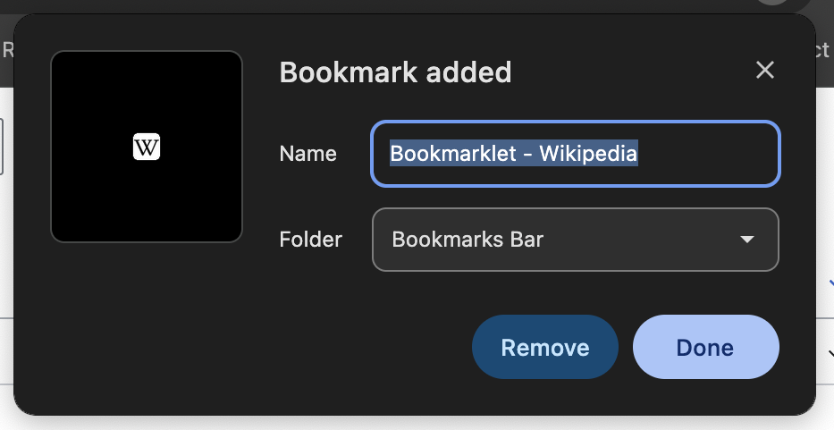
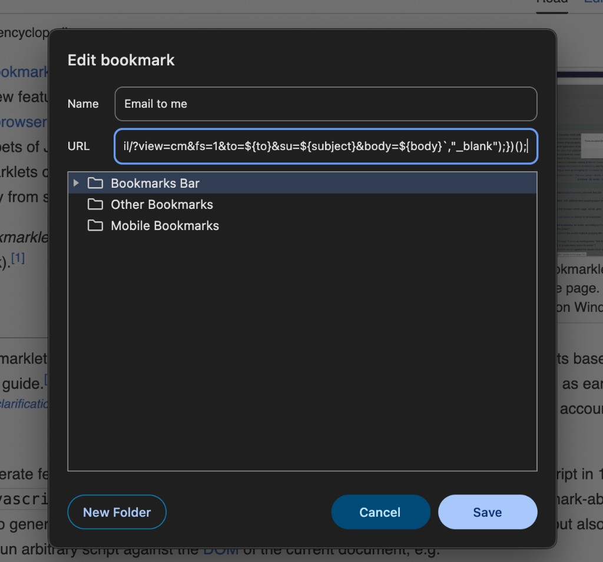
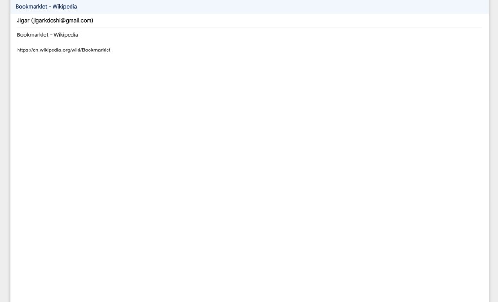
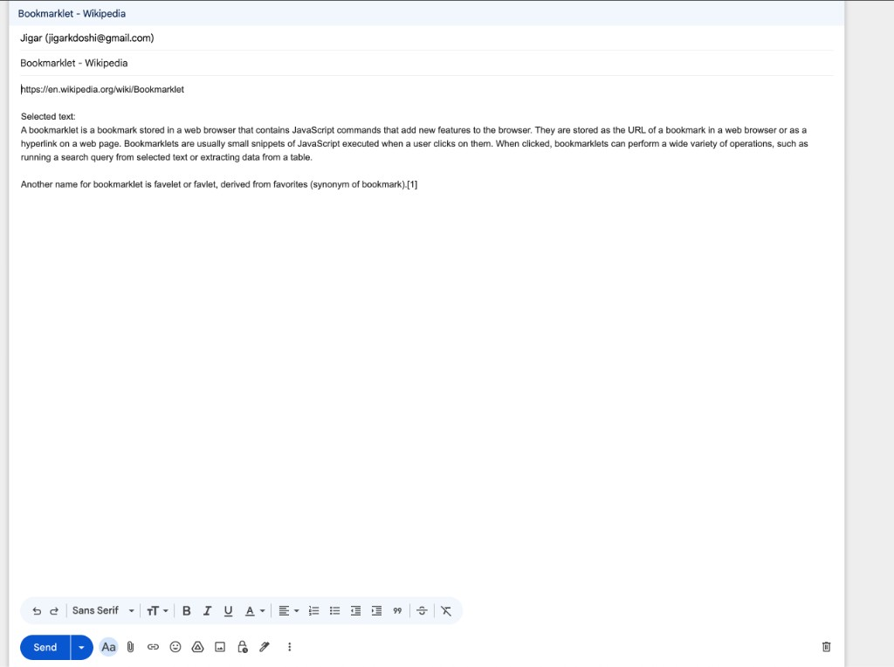

# Gmail Read-Later Bookmarklet

A tiny Chrome bookmarklet that emails the current page to yourself through Gmail.

It is meant as a low-friction “read later” valve:

1. See something distracting.
2. Click the bookmarklet.
3. Gmail opens with the page title, URL, and optional selected text.
4. Click **Send**.
5. Return to the work.

No extension. No backend. No API key. No tracking. No account beyond Gmail.

[View as a webpage](https://artvandelay.github.io/gmail-read-later-bookmarklet/) · [View source on GitHub](https://github.com/artvandelay/gmail-read-later-bookmarklet)

---

## Bookmarklet

Replace `YOUR_EMAIL@gmail.com` with your email address.

```javascript
javascript:(()=>{const to="YOUR_EMAIL@gmail.com";const title=document.title||"Untitled page";const url=location.href;const sel=window.getSelection().toString().trim();const subject=encodeURIComponent(title);const body=encodeURIComponent(`${url}${sel?`\n\nSelected text:\n${sel}`:""}`);window.open(`https://mail.google.com/mail/?view=cm&fs=1&to=${to}&su=${subject}&body=${body}`,"_blank");})();
```

---

## What the email looks like

If no text is selected:

```text
Subject:
<Page title>

Body:
<URL>
```

If text is selected before clicking:

```text
Subject:
<Page title>

Body:
<URL>

Selected text:
<Highlighted passage>
```

---

## Installation in Chrome

1. Open any webpage.
2. Press **Cmd+D** (macOS) or **Ctrl+D** (Windows/Linux). A small popup appears:



3. Click **Done** to save the bookmark as-is.
4. Find the new bookmark in the bookmarks bar, right-click it, and choose **Edit…**
5. Set the name to **Email to me**.
6. Replace the **URL** field with the bookmarklet JavaScript above.
7. Select **Bookmarks Bar** as the folder.
8. Click **Save**.



---

## Usage

Basic use:

1. Open a webpage.
2. Click the bookmarklet.
3. Gmail compose opens with the page title and URL filled in.
4. Click **Send**.



Better use:

1. Highlight the exact paragraph or line that triggered the distraction.
2. Click the bookmarklet.
3. Gmail compose opens with that selected text included.
4. Click **Send**.



This keeps the capture small and useful without turning it into a full note-taking system.

---

## Why this exists

Most read-later systems become another inbox. This bookmarklet is deliberately dumb.

It does not try to summarize, classify, archive, or organize. It only gets the shiny thing out of the current attention loop.

The self-email becomes a default queue. Whether it is read later or not is secondary. The main value is preserving focus now.

---

## Limitations

This bookmarklet cannot:

- send the email automatically
- attach a PDF
- attach a screenshot
- capture videos or audio
- capture a YouTube transcript unless it is visible/selectable on the page
- run on Chrome internal pages such as `chrome://settings`
- bypass Gmail or browser security restrictions

Those are features, not bugs. The goal is to stay simple and safe.

---

## Optional future version

A more advanced version could run as a local script or cron job:

1. Search Gmail for self-emails.
2. Extract the URL and selected text.
3. Fetch the page.
4. Call an LLM through OpenRouter or a local model.
5. Add a summary, label, or forward the processed result.

That should happen outside the bookmarklet so API keys are never exposed in browser JavaScript.

---

## Security note

Do not put API keys inside bookmarklets.

Bookmarklets run as JavaScript in the browser page context. Anything secret placed in them can be exposed. This version intentionally contains no secret except the destination email address.
